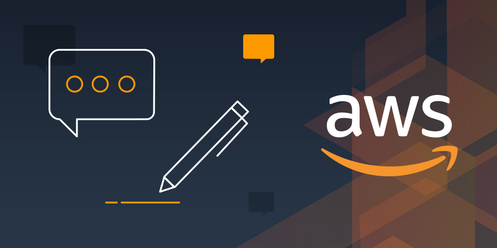

## AWS Bootcamp | Resource | Document | Materials | 

|    Topic Name        |      Link      |  
|----------        |:-------------:|
| 1. AWS EC2  |  [Elastic Compute Cloud](https://github.com/imsanjoykb/AWSBootcamp/blob/master/EC2_learning.pdf) |
| 2. AWS S3 |    [S3 Cheatsheet](https://github.com/imsanjoykb/AWSBootcamp/blob/master/S3_Cheatsheet.pdf)   |  
| 3. Virtual Private Cloud | [Virtual Private Cloud - VPC ](https://github.com/imsanjoykb/AWSBootcamp/blob/master/S3_Cheatsheet.pdf) | 
| 4. AWS Auto Scaling | [AWS Auto Scaling PDF ](https://github.com/imsanjoykb/AWSBootcamp/blob/master/AWS%20ASG%20%2B%20ALB.pdf) |  
| 5. Elastic Load Balancer | [Elastic Load Balancer - ELB Document ](https://github.com/imsanjoykb/AWSBootcamp/blob/master/AWS%20ASG%20%2B%20ALB.pdf) |  
| 6. AWS Route 53 | [ AWS Route 53 ](https://github.com/imsanjoykb/AWSBootcamp/blob/master/AWS_Route_53.pdf) |   
| 7. AWS Glue  | [ AWS Glue tutorial ](https://github.com/imsanjoykb/AWSBootcamp/blob/master/glue-tutorial.pdf) |   
| 8. AWS Glue ETL Pipeldine | [ Arts & Crafts of AWS Glue - ETL Pipeline ](https://github.com/imsanjoykb/AWSBootcamp/blob/master/glue-tutorial.pdf) |    
| 9. RDS | [ Relational Database Services - RDS ](https://github.com/imsanjoykb/AWSBootcamp/blob/master/RDS%20%2B%20NoSql%20DynamoDB.pdf) |   
| 10.NoSql DynamoDB | [ AWS NoSql DynamoDB ](https://github.com/imsanjoykb/AWSBootcamp/blob/master/RDS%20%2B%20NoSql%20DynamoDB.pdf) | 
| 11. HammerDB EC2 | [ AWS HammerDB ](https://github.com/imsanjoykb/AWSBootcamp/tree/master/HammerDB_EC2) | 
| 12. AWS Lambda | [ AWS Lambda ](https://github.com/imsanjoykb/AWSBootcamp/blob/master/AWS%20Serverless%20%2B%20Application%20Services.pdf) | 
| 13. AWS Serverless | [ AWS Serverless ](https://github.com/imsanjoykb/AWSBootcamp/blob/master/AWS%20Serverless%20%2B%20Application%20Services.pdf) | 
| 14. Simple Notification Services | [ Simple Notification Services - SNS ](https://github.com/imsanjoykb/AWSBootcamp/blob/master/AWS%20Serverless%20%2B%20Application%20Services.pdf) | 
| 15. Amazon EventBridge | [ Amazon Event Bridge ](https://github.com/imsanjoykb/AWSBootcamp/blob/master/AWS%20Serverless%20%2B%20Application%20Services.pdf) | 
| 16. AWS Certified Solutions Architect Exam Guide | [ AWS Certified Solutions Architect Exam Guide ](https://github.com/imsanjoykb/AWSBootcamp/blob/master/AWS%20Serverless%20%2B%20Application%20Services.pdf) |

Objectives
------

-	📒 Marks standard/official AWS pages and docs
-	🔹 Important or often overlooked tip
-	❗ “Serious” gotcha (used where risks or time or resource costs are significant: critical security risks, mistakes with significant financial cost, or poor architectural choices that are fundamentally difficult to correct)
-	🔸 “Regular” gotcha, limitation, or quirk (used where consequences are things not working, breaking, or not scaling gracefully)
-	📜 Undocumented feature (folklore)
-	🐥 Relatively new (and perhaps immature) services or features
-	⏱ Performance discussions
-	⛓ Lock-in: Products or decisions that are likely to tie you to AWS in a new or significant way — that is, later moving to a non-AWS alternative would be costly in terms of engineering effort
-	🚪 Alternative non-AWS options
-	💸 Cost issues, discussion, and gotchas
-	🕍 A mild warning attached to “full solution” or opinionated frameworks that may take significant time to understand and/or might not fit your needs exactly; the opposite of a point solution (the cathedral is a nod to [Raymond’s metaphor](https://en.wikipedia.org/wiki/The_Cathedral_and_the_Bazaar)\)
-	📗📘📙 Colors indicate basics, tips, and gotchas, respectively.
-	🚧 Areas where correction or improvement are needed (possibly with link to an issue — do help!)

General Information
-------------------

### When to Use AWS

-	[AWS](https://en.wikipedia.org/wiki/Amazon_Web_Services) is the dominant public cloud computing provider.
	-	In general, “[cloud computing](https://en.wikipedia.org/wiki/Cloud_computing)” can refer to one of three types of cloud: “public,” “private,” and “hybrid.” AWS is a public cloud provider, since anyone can use it. Private clouds are within a single (usually large) organization. Many companies use a hybrid of private and public clouds.
	-	The core features of AWS are [infrastructure-as-a-service](https://en.wikipedia.org/wiki/Cloud_computing#Infrastructure_as_a_service_.28IaaS.29) (IaaS) — that is, virtual machines and supporting infrastructure. Other cloud service models include [platform-as-a-service](https://en.wikipedia.org/wiki/Cloud_computing#Platform_as_a_service_.28PaaS.29) (PaaS), which typically are more fully managed services that deploy customers’ applications, or [software-as-a-service](https://en.wikipedia.org/wiki/Cloud_computing#Software_as_a_service_.28SaaS.29) (SaaS), which are cloud-based applications. AWS does offer a few products that fit into these other models, too.
	-	In business terms, with infrastructure-as-a-service you have a variable cost model — it is [OpEx, not CapEx](http://www.investopedia.com/ask/answers/020915/what-difference-between-capex-and-opex.asp) (though some [pre-purchased contracts](https://aws.amazon.com/ec2/purchasing-options/reserved-instances/) are still CapEx).
  - AWS’s TTM revenue was [**$37.549 billion**](https://ir.aboutamazon.com/news-release/news-release-details/2020/Amazoncom-Announces-First-Quarter/default.aspx) as of Q1 2020 according to their earnings results (slide 14 in the linked deck), or roughly **14%** of Amazon.com’s total revenue (slide 11 in the same deck) for the same TTM period.
-	**Main reasons to use AWS:**
	-	If your company is building systems or products that may need to scale
	-	and you have technical know-how
	-	and you want the most flexible tools
	-	and you’re not significantly tied into different infrastructure already
	-	and you don’t have internal, regulatory, or compliance reasons you can’t use a public cloud-based solution
	-	and you’re not on a Microsoft-first tech stack
	-	and you don’t have a specific reason to use Google Cloud
	-	and you can afford, manage, or negotiate its somewhat higher costs
	-	... then AWS is likely a good option for your company.
-	Each of those reasons above might point to situations where other services are preferable. In practice, many, if not most, tech startups as well as a number of modern large companies can or already do benefit from using AWS. Many large enterprises are partly migrating internal infrastructure to Azure, Google Cloud, and AWS.
-	**Costs:** Billing and cost management are such big topics that we have [an entire section on this](#billing-and-cost-management).
-	🔹**EC2 vs. other services:** Most users of AWS are most familiar with [EC2](#ec2), AWS’ flagship virtual server product, and possibly a few others like S3 and CLBs. But AWS products now extend far beyond basic IaaS, and often companies do not properly understand or appreciate all the many AWS services and how they can be applied, due to the [sharply growing](#which-services-to-use) number of services, their novelty and complexity, branding confusion, and fear of ⛓lock-in to proprietary AWS technology. Although a bit daunting, it’s important for technical decision-makers in companies to understand the breadth of the AWS services and make informed decisions. (We hope this guide will help.)
-	🚪**AWS vs. other cloud providers:** While AWS is the dominant IaaS provider (31% market share in [this 2016 estimate](https://www.srgresearch.com/articles/aws-remains-dominant-despite-microsoft-and-google-growth-surges)), there is significant competition and alternatives that are better suited to some companies. [This Gartner report](https://www.gartner.com/doc/reprints?id=1-2G2O5FC&ct=150519&st=sb) has a good overview of the major cloud players :
	-	[**Google Cloud Platform**](https://cloud.google.com/). GCP arrived later to market than AWS, but has vast resources and is now used widely by many companies, including a few large ones. It is gaining market share. Not all AWS services have similar or analogous services in GCP. And vice versa: In particular, GCP offers some more advanced machine learning-based services like the [Vision](https://cloud.google.com/vision/), [Speech](https://cloud.google.com/speech/), and [Natural Language](https://cloud.google.com/natural-language/) APIs. It’s not common to switch once you’re up and running, but it does happen: [Spotify migrated](http://www.wsj.com/articles/google-cloud-lures-amazon-web-services-customer-spotify-1456270951) from AWS to Google Cloud. There is more discussion [on Quora](https://www.quora.com/What-are-the-reasons-to-choose-AWS-over-Google-Cloud-or-vice-versa-for-a-high-traffic-web-application) about relative benefits. Of particular note is that VPCs in GCP are [global by default](https://cloud.google.com/vpc/) with subnetworks per region, while AWS’ VPCs have to live within a particular region. This gives GCP an edge if you’re designing applications with geo-replication from the beginning. It’s also possible to [share one GCP VPC](https://cloud.google.com/compute/docs/shared-vpc/) between multiple projects (roughly analogous to AWS accounts), while in AWS you’d have to peer them. It’s also possible to [peer GCP VPCs](https://cloud.google.com/compute/docs/vpc/vpc-peering) in a similar manner to how it’s done in AWS.
	-	[**Microsoft Azure**](https://azure.microsoft.com/en) is the de facto choice for companies and teams that are focused on a Microsoft stack, and it has now placed significant emphasis on Linux as well
	-	In **China**, AWS’ footprint is relatively small. The market is dominated by Alibaba’s [Alibaba Cloud](https://www.alibabacloud.com/), formerly called [Aliyun](https://intl.aliyun.com/).
	-	Companies at (very) large scale may want to reduce costs by managing their own infrastructure. For example, [Dropbox migrated](https://news.ycombinator.com/item?id=11282948) to their own infrastructure.
	-	Other cloud providers such as [Digital Ocean](https://www.digitalocean.com/) offer similar services, sometimes with greater ease of use, more personalized support, or lower cost. However, none of these match the breadth of products, mind-share, and market domination AWS now enjoys.
	-	Traditional managed hosting providers such as [Rackspace](https://www.rackspace.com/) offer cloud solutions as well.
-	🚪**AWS vs. PaaS:** If your goal is just to put up a single service that does something relatively simple, and you’re trying to minimize time managing operations engineering, consider a [platform-as-a-service](https://en.wikipedia.org/wiki/Platform_as_a_service) such as [Heroku](https://www.heroku.com/). The AWS approach to PaaS, Elastic Beanstalk, is arguably more complex, especially for simple use cases.
-	🚪**AWS vs. web hosting:** If your main goal is to host a website or blog, and you don’t expect to be building an app or more complex service, you may wish consider one of the myriad [web hosting services](https://www.google.com/search?q=web+hosting).
-	🚪**AWS vs. managed hosting:** Traditionally, many companies pay [managed hosting](https://en.wikipedia.org/wiki/Dedicated_hosting_service) providers to maintain physical servers for them, then build and deploy their software on top of the rented hardware. This makes sense for businesses who want direct control over hardware, due to legacy, performance, or special compliance constraints, but is usually considered old fashioned or unnecessary by many developer-centric startups and younger tech companies.
-	**Complexity:** AWS will let you build and scale systems to the size of the largest companies, but the complexity of the services when used at scale requires significant depth of knowledge and experience. Even very simple use cases often require more knowledge to do “right” in AWS than in a simpler environment like Heroku or Digital Ocean. (This guide may help!)
-	**Geographic locations:** AWS has data centers in [over a dozen geographic locations](http://docs.aws.amazon.com/AWSEC2/latest/UserGuide/using-regions-availability-zones.html#concepts-available-regions), known as **regions**, in Europe, East Asia, North and South America, and now Australia and India. It also has many more **edge locations** globally for reduced latency of services like CloudFront.
	-	See the [current list](https://aws.amazon.com/about-aws/global-infrastructure/) of regions and edge locations, including upcoming ones.
	-	If your infrastructure needs to be in close physical proximity to another service for latency or throughput reasons (for example, latency to an ad exchange), viability of AWS may depend on the location.
-	⛓**Lock-in:** As you use AWS, it’s important to be aware when you are depending on AWS services that do not have equivalents elsewhere.
	-	Lock-in may be completely fine for your company, or a significant risk. It’s important from a business perspective to make this choice explicitly, and consider the cost, operational, business continuity, and competitive risks of being tied to AWS. AWS is such a dominant and reliable vendor, many companies are comfortable with using AWS to its full extent. Others can tell stories about the [dangers of “cloud jail” when costs spiral](http://firstround.com/review/the-three-infrastructure-mistakes-your-company-must-not-make/).
	-	Generally, the more AWS services you use, the more lock-in you have to AWS — that is, the more engineering resources (time and money) it will take to change to other providers in the future.
	-	Basic services like virtual servers and standard databases are usually easy to migrate to other providers or on premises. Others like load balancers and IAM are specific to AWS but have close equivalents from other providers. The key thing to consider is whether engineers are architecting systems around specific AWS services that are not open source or relatively interchangeable. For example, Lambda, API Gateway, Kinesis, Redshift, and DynamoDB do not have substantially equivalent open source or commercial service equivalents, while EC2, RDS (MySQL or Postgres), EMR, and ElastiCache more or less do. (See more [below](#which-services-to-use), where these are noted with ⛓.)
-	**Combining AWS and other cloud providers:** Many customers combine AWS with other non-AWS services. For example, legacy systems or secure data might be in a managed hosting provider, while other systems are AWS. Or a company might only use S3 with another provider doing everything else. However small startups or projects starting fresh will typically stick to AWS or Google Cloud only.
-	**Hybrid cloud:** In larger enterprises, it is common to have [hybrid deployments](https://aws.amazon.com/enterprise/hybrid/) encompassing private cloud or on-premises servers and AWS — or other enterprise cloud providers like [IBM](https://www.ibm.com/it-infrastructure/solutions/hybrid-cloud)/[Bluemix](http://www.ibm.com/cloud-computing/bluemix/hybrid/), [Microsoft](https://www.microsoft.com/en-us/cloud-platform/hybrid-cloud)/[Azure](https://azure.microsoft.com/en-us/overview/azure-stack/), [NetApp](http://www.netapp.com/us/solutions/cloud/hybrid-cloud/), or [EMC](http://www.emc.com/en-us/cloud/hybrid-cloud-computing/index.htm).
-	**Major customers:** Who uses AWS and Google Cloud?
	-	AWS’s [list of customers](https://aws.amazon.com/solutions/case-studies/) includes large numbers of mainstream online properties and major brands, such as Netflix, Pinterest, Spotify (moving to Google Cloud), Airbnb, Expedia, Yelp, Zynga, Comcast, Nokia, and Bristol-Myers Squibb.
	-	Azure’s [list of customers](https://azure.microsoft.com/en-us/case-studies/) includes companies such as NBC Universal, 3M and Honeywell Inc.
	-	Google Cloud’s [list of customers](https://cloud.google.com/customers/) is large as well, and includes a few mainstream sites, such as [Snapchat](http://www.businessinsider.com/snapchat-is-built-on-googles-cloud-2014-1), Best Buy, Domino’s, and Sony Music.

## Which Services to Use

-	AWS offers a *lot* of different services — [about a hundred](https://aws.amazon.com/products/) at last count.
-	Most customers use a few services heavily, a few services lightly, and the rest not at all. What services you’ll use depends on your use cases. Choices differ substantially from company to company.
-	**Immature and unpopular services:** Just because AWS has a service that sounds promising, it doesn’t mean you should use it. Some services are very narrow in use case, not mature, are overly opinionated, or have limitations, so building your own solution may be better. We try to give a sense for this by breaking products into categories.
-	**Must-know infrastructure:** Most typical small to medium-size users will focus on the following services first. If you manage use of AWS systems, you likely need to know at least a little about all of these. (Even if you don’t use them, you should learn enough to make that choice intelligently.)
	-	[IAM](#security-and-iam): User accounts and identities (you need to think about accounts early on!)
	-	[EC2](#ec2): Virtual servers and associated components, including:
		-	[AMIs](#amis): Machine Images
		-	[Load Balancers](#load-balancers): CLBs and ALBs
		-	[Autoscaling](#auto-scaling): Capacity scaling (adding and removing servers based on load)
		-	[EBS](#ebs): Network-attached disks
		-	[Elastic IPs](#elastic-ips): Assigned IP addresses
	-	[S3](#s3): Storage of files
	-	[Route 53](#route-53): DNS and domain registration
	-	[VPC](#vpcs-network-security-and-security-groups): Virtual networking, network security, and co-location; you automatically use
	-	[CloudFront](#cloudfront): CDN for hosting content
	-	[CloudWatch](#cloudwatch): Alerts, paging, monitoring
-	**Managed services:** Existing software solutions you could run on your own, but with managed deployment:
	-	[RDS](#rds): Managed relational databases (managed MySQL, Postgres, and Amazon’s own Aurora database)
	-	[EMR](#emr): Managed Hadoop
	-	[Elasticsearch](https://aws.amazon.com/elasticsearch-service/): Managed Elasticsearch
	-	[ElastiCache](https://aws.amazon.com/elasticache/): Managed Redis and Memcached
-	**Optional but important infrastructure:** These are key and useful infrastructure components that are less widely known and used. You may have legitimate reasons to prefer alternatives, so evaluate with care to be sure they fit your needs:
	-	⛓[Lambda](#lambda): Running small, fully managed tasks “serverless”
	-	[CloudTrail](https://aws.amazon.com/cloudtrail/): AWS API logging and audit (often neglected but important)
	-	⛓🕍[CloudFormation](#cloudformation): Templatized configuration of collections of AWS resources
	-	🕍[Elastic Beanstalk](https://aws.amazon.com/elasticbeanstalk/): Fully managed (PaaS) deployment of packaged Java, .NET, PHP, Node.js, Python, Ruby, Go, and Docker applications
	-	🐥[EFS](#efs): Network filesystem compatible with NFSv4.1
	-	⛓🕍[ECS](#ecs): Docker container/cluster management (note Docker can also be used directly, without ECS)
	-   🕍 [EKS](#eks): Kubernetes (K8) Docker Container/Cluster management
	-	⛓[ECR](https://aws.amazon.com/ecr/): Hosted private Docker registry
	-	🐥[Config](https://aws.amazon.com/config/): AWS configuration inventory, history, change notifications
	-	🐥[X-Ray](https://aws.amazon.com/xray/): Trace analysis and debugging for distributed applications such as microservices.
-	**Special-purpose infrastructure:** These services are focused on specific use cases and should be evaluated if they apply to your situation. Many also are proprietary architectures, so tend to tie you to AWS.
	-	⛓[DynamoDB](#dynamodb): Low-latency NoSQL key-value store
	-	⛓[Glacier](#glacier): Slow and cheap alternative to S3
	-	⛓[Kinesis](https://aws.amazon.com/kinesis/): Streaming (distributed log) service
	-	⛓[SQS](https://aws.amazon.com/sqs/): Message queueing service
	-	⛓[Redshift](#redshift): Data warehouse
	-	🐥[QuickSight](https://aws.amazon.com/quicksight/): Business intelligence service
	-	[SES](https://aws.amazon.com/ses/): Send and receive e-mail for marketing or transactions
	-	⛓[API Gateway](https://aws.amazon.com/api-gateway/): Proxy, manage, and secure API calls
	-	⛓[IoT](#iot): Manage bidirectional communication over HTTP, WebSockets, and MQTT between AWS and clients (often but not necessarily “things” like appliances or sensors)
	-	⛓[WAF](https://aws.amazon.com/waf/): Web firewall for CloudFront to deflect attacks
	-	⛓[KMS](#kms): Store and manage encryption keys securely
	-	[Inspector](https://aws.amazon.com/inspector/): Security audit
	-	[Trusted Advisor](https://aws.amazon.com/premiumsupport/trustedadvisor/): Automated tips on reducing cost or making improvements
	-	🐥[Certificate Manager](https://aws.amazon.com/certificate-manager/): Manage SSL/TLS certificates for AWS services
	-	🐥⛓[Fargate](https://aws.amazon.com/fargate/): Docker containers management, backend for ECS and EKS
-	**Compound services:** These are similarly specific, but are full-blown services that tackle complex problems and may tie you in. Usefulness depends on your requirements. If you have large or significant need, you may have these already managed by in-house systems and engineering teams.
	-	[Machine Learning](https://aws.amazon.com/machine-learning/): Machine learning model training and classification
	-	[Lex](https://aws.amazon.com/lex/): Automatic speech recognition (ASR) and natural language understanding (NLU)
	-	[Polly](https://aws.amazon.com/polly/): Text-to-speech engine in the cloud
	-	[Rekognition](https://aws.amazon.com/rekognition/): Service for image recognition
	-	⛓🕍[Data Pipeline](https://aws.amazon.com/datapipeline/): Managed ETL service
	-	⛓🕍[SWF](https://aws.amazon.com/swf/): Managed state tracker for distributed polyglot job workflow
	-	⛓🕍[Lumberyard](https://aws.amazon.com/lumberyard/): 3D game engine
-	**Mobile/app development:**
	-	[SNS](https://aws.amazon.com/sns/): Manage app push notifications and other end-user notifications
	-	⛓🕍[Cognito](https://aws.amazon.com/cognito/): User authentication via Facebook, Twitter, etc.
	-	[Device Farm](https://aws.amazon.com/device-farm/): Cloud-based device testing
	-	[Mobile Analytics](https://aws.amazon.com/mobileanalytics/): Analytics solution for app usage
	-	🕍[Mobile Hub](https://aws.amazon.com/mobile/): Comprehensive, managed mobile app framework
-	**Enterprise services:** These are relevant if you have significant corporate cloud-based or hybrid needs. Many smaller companies and startups use other solutions, like Google Apps or Box. Larger companies may also have their own non-AWS IT solutions.
	-	[AppStream](https://aws.amazon.com/appstream/): Windows apps in the cloud, with access from many devices
	-	[Workspaces](https://aws.amazon.com/workspaces/): Windows desktop in the cloud, with access from many devices
	-	[WorkDocs](https://aws.amazon.com/workdocs/) (formerly Zocalo): Enterprise document sharing
	-	[WorkMail](https://aws.amazon.com/workmail/): Enterprise managed e-mail and calendaring service
	-	[Directory Service](https://aws.amazon.com/directoryservice/): Microsoft Active Directory in the cloud
	-	[Direct Connect](https://aws.amazon.com/directconnect/): Dedicated network connection between office or data center and AWS
	-	[Storage Gateway](https://aws.amazon.com/storagegateway/): Bridge between on-premises IT and cloud storage
	-	[Service Catalog](https://aws.amazon.com/servicecatalog/): IT service approval and compliance
-	**Probably-don't-need-to-know services:** Bottom line, our informal polling indicates these services are just not broadly used — and often for good reasons:
	-	[Snowball](https://aws.amazon.com/importexport/): If you want to ship petabytes of data into or out of Amazon using a physical appliance, read on.
	-	[Snowmobile](https://aws.amazon.com/snowmobile/): Appliances are great, but if you've got exabyte scale data to get into Amazon, nothing beats a tractor trailer full of drives.
	-	[CodeCommit](https://aws.amazon.com/codecommit/): Git service. You’re probably already using GitHub or your own solution ([Stackshare](http://stackshare.io/stackups/github-vs-bitbucket-vs-aws-codecommit) has informal stats).
	-	🕍[CodePipeline](https://aws.amazon.com/codepipeline/): Continuous integration. You likely have another solution already.
	-	🕍[CodeDeploy](https://aws.amazon.com/codedeploy/): Deployment of code to EC2 servers. Again, you likely have another solution.
	-	🕍[OpsWorks](https://aws.amazon.com/opsworks/): Management of your deployments using Chef or (as of November 2017) Puppet Enterprise.

### Author: Sanjoy Biswas
Data Scientist | AI Researcher  
Portfolio: https://imsanjoykb.github.io/  

Reference : 

https://github.com/open-guides/og-aws 
https://www.linkedin.com/in/kishan-patro-049919164/ 
https://www.linkedin.com/in/lydia-white-a30044138/ 
https://www.linkedin.com/in/jameslzhang/  

###

